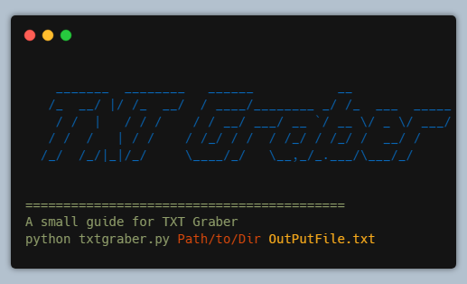

# TxtGraber

TxtGraber is Python Script aim to automate appending wordlists in one UlTIMATE wordlist file.
So, I made the script to grab all content of all .txt files of certain directories.

DirPath is your path to the directory which has the .txt files you want to grab their content.

OutPutFile.txt is your txt file will contain all the appended content.
If outputFile isn't existed already, It will be created by default in the current working directory.

